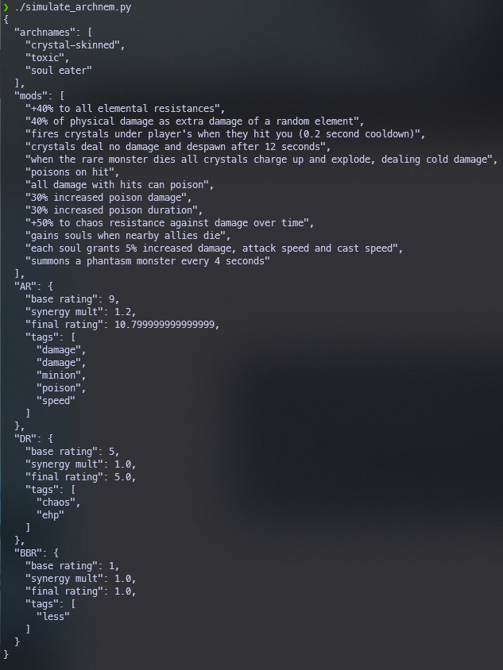

- [Path of Exile 3.18: Archnemesis Monster Simulator](#path-of-exile-318-archnemesis-monster-simulator)
  - [Disclaimer](#disclaimer)
  - [Overview](#overview)
  - [Scripts](#scripts)
    - [`fill_data.py`](#fill_datapy)
      - [Overview](#overview-1)
      - [Commandline Args](#commandline-args)
      - [Usage](#usage)
    - [`simulate_archnem.py`](#simulate_archnempy)
      - [Overview](#overview-2)
      - [Commandline Arguments](#commandline-arguments)
      - [Usage](#usage-1)
  - [Shortcomings](#shortcomings)

# Path of Exile 3.18: Archnemesis Monster Simulator

## Disclaimer

This set of data and scripts are in no way intended to be a solution/suggestion to the developers at GGG and were mostly written as a way for me to quantify what seems to be people's concerns. The modifiers and their interractions are subjective and the ratings applied to different mods reflect as much.

## Overview

These scripts allow a user to rate an archnemesis mod's attributes (rating for offense, defense, and build break-ability) and then use said ratings to quantify different mods' interractions. Since it seems that most of the issues people are having involves synergies between mods, the simulation script considers synergies defined by the user.

Since these scripts were thrown together very fast, there is no intuitive GUI. As such, most users will not find these scripts useful. To use them, **ensure that you have Python installed (at least version 3.8) and run the scripts from the command line. I will not outline how to do that.**

&nbsp;

## Scripts

### `fill_data.py`

#### Overview

Create user defined ratings/synergy tags for use in the simulation script. The script has an autosave feature, should you want to stop working on ratings and come back later. To quit, simply press `ctrl+c` at any point. To continue, call the script without the `-i` or `--infile` argument; should the autosave file exist, it will be used.

#### Commandline Args

| Short&nbsp;Arg | Long&nbsp;Arg | Type | Description |
| :--- | :--- | :--- | :--- |
| &#8209;i | &#8209;&#8209;infile | Path | Path to the desired file to load. Should the argument not be provided, the script will default to `.autosave` which is the autosaved file from a previous run. If no infile is provided and `.autosave` is not present, an empty file will be sourced from `src/empty.json`. |
| &#8209;o | &#8209;&#8209;outfile | Path | Path of the desired output file. The output is not written until all modifiers have been reviewed. The output file's contents are pulled from `.autosave`. Default value is `appraisal_data.json`. |
| &#8209;h | &#8209;&#8209;help |  | Show help message and quit. |

#### Usage

Upon calling the script, it will display the Archnemesis modifier name along with its attributes. Then the user will be prompted to provide `AR` (attack rating), `DR` (defense rating), `BBR` (build break rating) and their respective tags.

`AR`, `DR`, and `BBR` must be given an integer value and cannot be left blank. These values are arbitrary other, but it is suggested to keep the numbers relatively small in order to have meaningful numbers. I personally kept everything on a scale of `0` (non-existent) to `5` (hardest).

The tags can be left blank and have no stipulations other than individual tags are separated by `,` as seen above. The tags are used to identify synergies, so the more detailed the tags are, the better different synergies will be identied. An interesting side effect of implementing things this way is that it is possible to give an archnemesis mod a rating of `0`, but give it tags in order for it to still contribute to synergy calculations. Whether that's a feature or not is up to the user.

&nbsp;

### `simulate_archnem.py`

#### Overview

This script consumes an appraisal json file generated by `fill_data.py` and "creates" a monster for a given set of archnemesis modifiers. There is no weighting to the mods, meaning it's just as likely for the simulator to pick `Kitava-touched` as it is `Hasted`. This is intentional as GGG already has systems in their engine to pick mods with their own weighting. I do not know these weights and it is honestly unnecessary for this experimentation.

For a set of mods, the script will calculate the `AR`, `DR`, and `BBR` scores by summing the ratings from the appraisal file. It will then calculate a synergy multiplier for `AR`, `DR`, and `BBR` by counting the numder of unique instances of each tag within each rating's tags list. Those values are then decremented by one, summed, and used as the exponent for the `_SYNERGY_MULT` constand defined in the appraisal json. The reason it's done this way is so that if the tags list has no repetitions, the decremented summation of tag instances is 0, and if we recall from arithmetic, `n^(0)=1`. Thus, no synergy (no repeated tags) results in a multiplier of `1`. The synergy multipliers are then applied to the ratings to calculate a final rating. If this seems confusing, see image below - I believe it's more enlightening.

#### Commandline Arguments

| Short&nbsp;Arg | Long&nbsp;Arg | Type | Description |
| :--- | :--- | :--- | :--- |
| &#8209;f | &#8209;&#8209;valuesfile | Path | Path to file to read in for archnem mod ratings/tags. Default is `appraisal_data.json`, which is the default output name for `fill_data.py`. |
| &#8209;m | &#8209;&#8209;n_mods | int | Number of random archnemesis mods to select for simulation. Default is 3. |
| &#8209;M | &#8209;&#8209;mods | str | Space separated list of user defined archnemesis mods to use for simulation. Spelling (not capitalization) must match mods defined in read file. If an archnemesis mod has spaces in the name, encapsulate the mod name with quotes. |
| &#8209;h | &#8209;&#8209;help |  | Show help message and quit. |

#### Usage

Script simply spits out data based on commandline arguments as shown above. Not shown is the synergy multiplier constant from appraisal file. When I ran the code shown above, it was set to `1.2`.

&nbsp;

## Shortcomings

As said before, since this was thrown together quickly, there are definitely things that could be improved. Most notably is calculating the synergy multiplier for modifiers that cannot directly stack (e.g. immunities).

If I had more motivation/time, I would rerun the `fill_data.py` script and change the `BBR Tags` for immunities (like `immune to shock`) to be something like `immune-shock`. Then the simulation script would need to treat these tags differently; namely, count the number of *unique* `immune-` prefixed tags and count them up for synergy multiplier calculations. This would show that a monster is harder/more build-breaking since it has more things that it is immune to. I'm not going to make this change as the point is probably already long gone and GGG has some solution in the works and this work was for nothing. `¯\_(ツ)_/¯`
